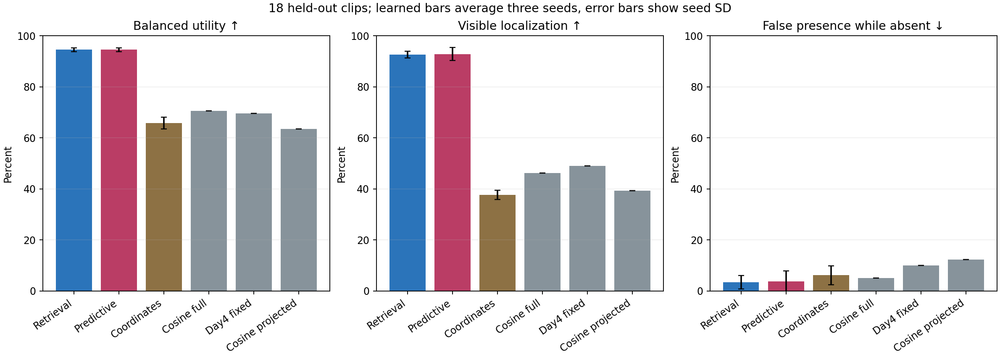

# Day7 results: learned JEPA part tracking

**A trained persistent-part head substantially improved visible tracking on this
synthetic benchmark. Adding the future-prediction objective did not establish an
additional tracking benefit.** The predictive head reached **92.87%** visible
localization, averaged over three training seeds, compared with **46.21%** for
frozen full-feature cosine matching. The matched head trained without the future
objective already reached **92.63%**.

The useful result is a trained, prompted representation that follows individual
parts much better than our frozen matching baselines in this small rendered
world. The unresolved result is whether learning to predict future part latents
improves identity consistency beyond training the same retrieval architecture.
This experiment uses V-JEPA features throughout; no SAM model is involved.

## What was trained and tested

The **871,810-parameter** head adds an immutable identity anchor, a learned
recurrent state for each part, context shared by sibling parts, and a forecast
consumed eight feature steps later. The backbone is frozen V-JEPA 2.1 ViT-L/384.
The original pretrained predictor is not used. A fixed projection reduces
1024-dimensional features to 256 dimensions; centering is fitted on training
clips only.

Both visual arms have the same architecture and active forecast path. The
`retrieval_only` arm learns from localization/absence labels. The `predictive`
arm additionally learns to match future frozen part representations. Therefore
this comparison tests **the extra predictive supervision**, not the presence
versus absence of a forecast module. A third, equally sized coordinate-only
control receives positional features and no visual features.

There were **36 training clips, 9 development clips, and 18 held-out test clips**.
Each contains 64 frames and four tagged parts: a door and window on each of two
cars. Corresponding parts have identical appearance; their surrounding cars
provide identity context. Whole-clip flips and coherent identity permutations
reduce fixed-position shortcuts. Every arm was trained for 30 epochs with each
of the paired seeds **1701, 1702 and 1703**, giving nine completed runs. The
predeclared development rule chose each checkpoint before test access.

Training uses synthetic part labels, so this is supervised head training.
Inference receives RGB-derived tokens, frame-zero part prompts and the sibling
relation. It receives no later masks, visibility labels or trajectories. The
output is a visible/absent decision and a 16-pixel grid location for each tag,
not a dense segmentation or generated edit.

## Held-out tracking results

Values for learned arms are arithmetic means across the three predetermined
training seeds. The same 18 clips were reused for every seed; this is not a
54-video test. Per run, scoring contains **1,926 visible target-tubelets, 259
fully absent target-tubelets and 18 immediate-recovery events**. A tubelet is
two frames. The first tubelet is excluded, as are 47 ambiguous observations
where a visible sliver has no qualifying patch.

| Method | Visible localization ↑ | False presence while absent ↓ | Wrong car when visible ↓ | Immediate recovery ↑ | Balanced utility ↑ |
|---|---:|---:|---:|---:|---:|
| Frozen full-feature cosine | 46.21% | 5.02% | 8.83% | 22.22% | 70.60% |
| Previous fixed context/motion tracker | 49.12% | 10.04% | 8.15% | 16.67% | 69.54% |
| Frozen centered/projected cosine | 39.30% | 12.36% | 6.96% | 27.78% | 63.47% |
| Learned coordinate-only control | 37.73% | 6.18% | 2.42% | 0.00% | 65.78% |
| Learned retrieval-only head | 92.63% | 3.47% | 3.93% | 7.41% | 94.58% |
| Learned predictive head | **92.87%** | 3.73% | 3.84% | 20.37% | 94.57% |

Balanced utility is the mean of visible localization accuracy and absent
specificity, where specificity is one minus false-presence rate. The predictive
head's visible gain over full-feature cosine is **46.66 percentage points**,
with a paired clip interval of **[37.94, 53.95] pp**. Its strong advantage over
the coordinate-only control supports a contribution from visual features under
this training setup. It does not establish generalization beyond the renderer.

The fixed [comparison video](run_2026-10-09/analysis/test_crossing_10200_fixed_comparison.mp4)
shows crossing clip 10200 and training seed 1701. These were specified before
results, rather than selected for a favourable outcome.

## The predictive objective's added value

The primary predictive-minus-retrieval-only utility difference is **−0.008 pp**,
with a **95% paired clip-bootstrap interval of [−3.118, +4.131] pp**. This does
not pass the predeclared evidence rule. Both mean guardrails, allowing at most
1 pp loss in visible localization or absent specificity, pass; the required
positive utility effect with an interval excluding zero does not.

Each of 2,000 bootstrap draws resamples the same 18 whole clips across all three
seeds. The resulting interval describes clip variation conditional on these
trained seeds. Between-seed variation is reported separately.

| Training seed | Retrieval visible | Predictive visible | Predictive − retrieval utility | Predictive immediate recovery |
|---|---:|---:|---:|---:|
| 1701 | 91.12% | 91.48% | −0.590 pp | 1/18 |
| 1702 | 92.99% | 95.85% | −0.310 pp | 9/18 |
| 1703 | 93.77% | 91.28% | +0.877 pp | 1/18 |

Visible-localization sample standard deviations across seeds are **1.36 pp**
for retrieval-only and **2.58 pp** for predictive. The paired utility difference
has a between-seed sample standard deviation of **0.779 pp**. Development had
favoured predictive by 1.795 pp of utility, but that advantage did not carry over
to the held-out primary result.

The future objective did learn its target. Mean cosine similarity to the future
part representation was **0.8661** for predictive forecasts, compared with
**0.7348** for copying the initial anchor and **0.7261** for copying the last
retrieved representation from the predictive head. Ranking the correct future
part against other visible parts succeeded **86.62%** of the time, compared
with **74.34%** for the initial anchor. These diagnostics use 1,450 distinct
scored target rows per seed, all with at least two visible candidates. Rows
within clips are correlated.

This establishes a learned future-latent signal in this setup. It does not show
that the signal improved the primary tracking objective. The same-architecture
retrieval control is essential to that distinction.

## Recovery and mechanism checks

Reappearance remains unreliable. Predictive immediate recovery was 1/18, 9/18
and 1/18 across seeds. Across these 54 repeated evaluations of the same 18 events,
all **43 predictive failures were non-emission**: the head still declared the
part absent at its first qualifying visible step. This identifies a failure of
the visibility decision at reappearance, without isolating why that decision
failed. It does not imply that later recovery never happens. Retrieval-only
recovered 1/18, 1/18 and 2/18;
its failures included 41 non-emissions and nine emitted localization errors.

Post-test interventions checked whether the fixed heads depend on forecasts and
sibling context. Normal replay exactly matched saved outputs before intervention.
No checkpoint, threshold or method was selected from these results.

| Intervention on predictive checkpoints | Mean change in visible localization | Mean change in false presence |
|---|---:|---:|
| Replace queued forecasts with the initial anchor | −0.710 pp | −0.129 pp |
| Set sibling/owner context to zero | +0.571 pp | +95.109 pp |

Replacing forecasts changed **7.28–11.67%** of emitted decisions across the
three predictive seeds. Thus the forecasts affect the computation, even though
the average tracking effect was small and mixed. Removing sibling context
largely destroyed absence handling: false presence rose from 3.73% to **98.84%**
on average. Apparent recovery improvements under that intervention must be read
alongside this tendency to emit almost everywhere.

These interventions measure reliance of already trained checkpoints. They alter
the input/state distribution and have downstream recurrent effects. They do not
prove that a retrained model without the component would be worse, that a
hierarchy is uniquely responsible for the gain, or that predictive supervision
caused a task benefit. See the complete
[mechanism diagnostic results](run_2026-10-09/diagnostics/mechanism_reliance_v1/reliance_results.json).

## Verification and retained evidence

The run completed on a Colab Tesla T4 with the prescribed training budget and
no OOM fallback. Source, model, data and extraction files were frozen at
[`1d9f12a`](https://github.com/skbdps/vjepa-poc/commit/1d9f12a5f51b061e33a4417d2789c203b5d1dc86),
analysis/export helpers at
[`9af4259`](https://github.com/skbdps/vjepa-poc/commit/9af4259467caa0bdf7980ef83d856fae1f70f61f),
and the checkpoint freeze at
[`b603bd7`](https://github.com/skbdps/vjepa-poc/commit/b603bd76ee97673beff91a79f08292d19276d85c).
The exact Git freeze bytes were verified before test extraction. The freeze
SHA-256 is `d22db32b2fe60d648170ed38970b6dcb274f322cc5630b020db6d996f319dd62`.

Independent analysis recounted all **26,784 primary rows** from **216 saved
prediction archives**, checked every per-target CSV observation and aggregate
result, and validated frozen source/feature provenance. Forecast statistics were
checked against saved diagnostic rows; this was not an independent recomputation
of encoder features or future cosine values.

- [Independent analysis](run_2026-10-09/analysis/INDEPENDENT_ANALYSIS.md) and [machine-readable results](run_2026-10-09/analysis/independent_analysis.json).
- [Raw tracking results](run_2026-10-09/test/results.json), [prediction rows](run_2026-10-09/test/prediction_rows.csv) and [future diagnostic rows](run_2026-10-09/test/future_rows.csv).
- [Learning curves](run_2026-10-09/analysis/learning_curves.png), [development freeze](run_2026-10-09/DEVELOPMENT_FREEZE.md) and [Git freeze provenance](run_2026-10-09/git_freeze_provenance.json).
- [Export manifest](run_2026-10-09/EXPORT_MANIFEST.json) and [artifact limitations](run_2026-10-09/README_EXPORT.md).

The compact Git evidence retains exact scores, cells and eligibility, but omits
head weights and larger internal arrays. It is sufficient for recounting the
primary predictions, not for rerunning the full analysis or model interventions.
The separate full archive preserves original model/output files; reproducing
inference also needs the bound feature caches or their regeneration.

These results concern prompted patch tracking in three related 2-D synthetic
trajectory families. The encoder can use future frames within each 16-frame
block. There is no demonstrated real-video or face consistency, automatic part
discovery, dense edit quality, 3-D understanding, self-supervised learning benefit,
or literature novelty. The next useful research question is how to preserve
identity while reopening the visibility gate after disappearance, and then test
that change on fresh motion families and fresh held-out clips.

The [reproducible post-hoc recovery diagnosis](run_2026-10-09/analysis/recovery_diagnosis.json) records exact event counts, input hashes and the limits of the visibility-gate interpretation; [recovery_diagnosis.py](recovery_diagnosis.py) rebuilds it from saved evidence.
